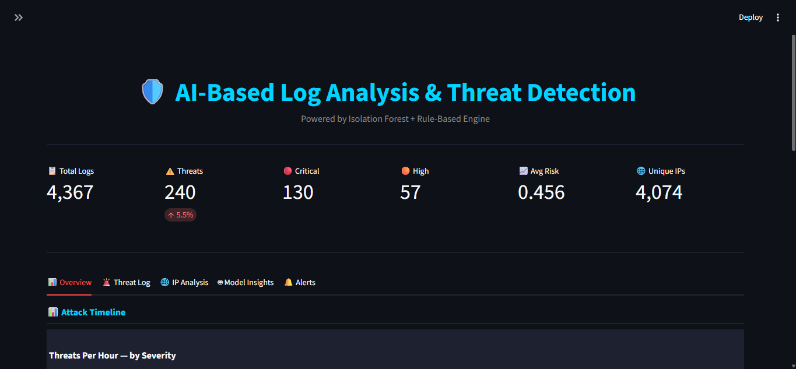
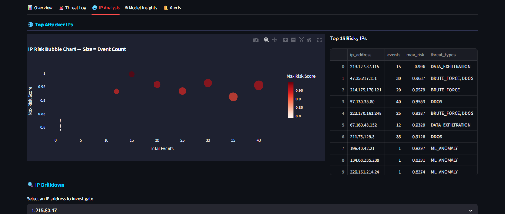
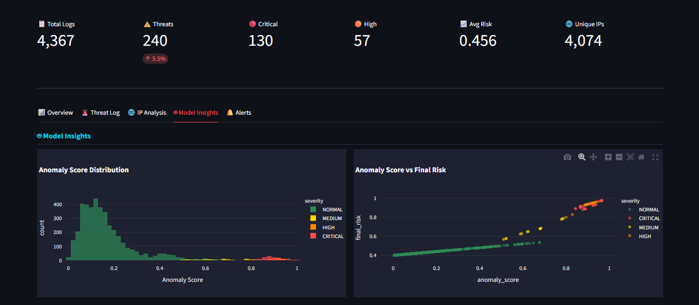
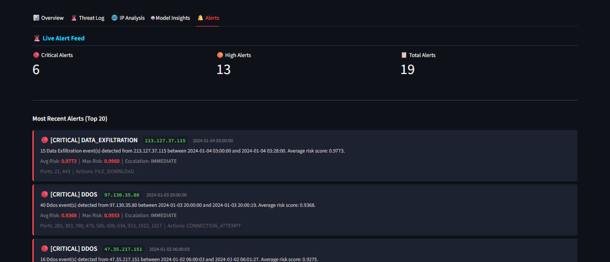

<div align="center">

# 🛡️ AI-Based Log Analysis & Threat Detection

> Automatically detects cybersecurity threats in server logs
> using Machine Learning + Rule-Based Intelligence


</div>

---

## 🤔 What Does This Project Do?

> Imagine your server generates **thousands of log entries every hour.**
> No human can read all of them.
> This system reads them automatically, finds attacks,
> and shows everything on a visual dashboard.

**Simple flow:**
```
Server Logs → Clean Data → Find Patterns →
Detect Attacks → Show Dashboard → Send Alerts
```

---

## 📸 Dashboard Screenshots

### Overview —  Attack Timeline


```
Total Logs : 4,367
Threats    : 240  (5.5%)
Critical   : 130
High       : 57
Avg Risk   : 0.456
Unique IPs : 4,074
```

### IP Analysis — Bubble Chart + Top Risky IPs



### Model Insights — Anomaly Score Distribution


```
Left Chart  → Normal traffic scores LOW (0.0-0.2)
              Attack traffic scores HIGH (0.7-1.0)
              Clear separation = model working correctly

Right Chart → Higher anomaly score = higher final risk
              CRITICAL alerts cluster top-right
              NORMAL traffic clusters bottom-left
```

### Live Alert Feed


```
Critical Alerts : 6
High Alerts     : 13
Total Alerts    : 19

Each alert shows:
→ Threat type + Source IP + Timestamp
→ Event count + Avg/Max risk score
→ Escalation level (IMMEDIATE/INVESTIGATE)
→ Ports targeted + Actions seen
```

---

## 🎯 What Attacks Does It Detect?

| Attack | What It Is | Severity |
|---|---|---|
| 🔴 **DDoS** | Flooding server with requests | CRITICAL |
| 🔴 **Data Exfiltration** | Stealing files from server | CRITICAL |
| 🟠 **Brute Force** | Trying many passwords | HIGH |
| 🟡 **Port Scan** | Mapping your network | HIGH |
| ⚪ **ML Anomaly** | Unusual pattern (unknown type) | MEDIUM |

---

## 🧰 Tech Stack

| What | Tool |
|---|---|
| Language | Python 3.11 |
| ML Model | Scikit-learn (Isolation Forest) |
| Dashboard | Streamlit |
| Charts | Plotly |
| Data | Pandas, NumPy |
| Model Save | Joblib |

---

## 📁 Project Structure

```
ai_threat_dashboard/
│
├── src/
│   ├── data_generator.py    ← Generate fake log data
│   ├── preprocess.py        ← Clean the data
│   ├── features.py          ← Build ML features
│   ├── model.py             ← Train Isolation Forest
│   ├── threat_detector.py   ← Classify attack types
│   └── alerts.py            ← Generate alerts
│
├── dashboard/
│   └── app.py               ← Streamlit dashboard
│
├── data/
│   ├── raw/                 ← Original logs
│   └── processed/           ← Cleaned + scored data
│
├── models/
│   ├── isolation_forest.pkl ← Saved ML model
│   └── plots/               ← Diagnostic charts
│
├── config.py                ← All settings in one place
├── main.py                  ← Run everything
└── requirements.txt
```

---

## 📊 Results

| Metric | Value |
|---|---|
| Total Logs Processed | 4,367 |
| Threats Detected | 240 (5.5%) |
| Critical Alerts | 130 |
| Avg Risk Score | 0.456 |
| Alert Noise Reduced | 88% (deduplication) |

---

## 🔍 How It Works (Simple Version)

```
STEP 1 — Learn Normal
  Model studies 4,367 server logs
  Learns what "normal" traffic looks like
  No labels needed (unsupervised)

STEP 2 — Find Anomalies
  Isolation Forest scores every log entry 0-1
  High score = suspicious behavior

STEP 3 — Classify Threat
  Rule engine checks: is this DDoS? Brute Force?
  Assigns severity: CRITICAL / HIGH / MEDIUM / LOW

STEP 4 — Show Dashboard
  5-tab Streamlit dashboard
  Filter by date, severity, threat type
  Drill into any suspicious IP

STEP 5 — Send Alerts
  Deduplicated alerts (no spam)
  Shows: what happened, which IP, what to do
```

---

## 📋 Dashboard Tabs

| Tab | What You See |
|---|---|
| 📊 Overview | Attack timeline + severity charts |
| 🚨 Threat Log | Searchable table of all threats |
| 🌐 IP Analysis | Risky IP bubble chart + drilldown |
| 🤖 Model Insights | Anomaly score distributions |
| 🔔 Alerts | Live alert feed with actions |

---

---

## ⚠️ Limitations

```
→ Uses synthetic data (not real server logs)
→ Batch processing (not real-time streaming)
→ No user login / authentication on dashboard
→ Low-and-slow attacks may be missed
```

**Planned improvements:**
```
→ Real dataset 
→ Docker deployment
→ Email/Slack alert notifications
→ SHAP explainability for each alert
```
